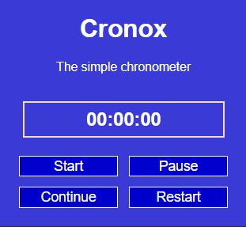

# Cronox

## ES

Un cronómetro simple, realizado como extensión de navegador.

La extensión tiene cuatro botones:

- Iniciar: empieza la cuenta del tiempo.
- Pausar: pausa la cuenta del tiempo transcurrido.
- Continuar: continúa la cuenta del tiempo, solo funciona si se ha pausado el tiempo anteriormente.
- Reiniciar: reinicia la cuenta del tiempo (pone el reloj en 00:00:00).

 Disponible en:

<!-- -    -->
- 
<!-- - Compatible con Edge -->

## EN

A simple chronometer, coded as a browser extension.

The extension has four buttons:

- Start: starts counting up time.
- Pause: pauses the elapsed time counting process.
- Continue: continues to count up time, only works if the pause button was pressed beforehand.
- Restart: restarts the chronometer (puts the clock back to 00:00:00).

Available in:

<!-- -    -->
- 
<!-- - Compatible with Edge -->

## PT

Um cronômetro simples, desenvolvido como uma extensão de navegador.

A extensão tem quatro botões:

- Inicializar: começa a contagem do tempo.
- Pausar: pausa a contagem de tempo decorrido.
- Continuar: continua a contagem de tempo, só funciona se o botão de pausa foi pressionado previamente.
- Reinicializar: redefine o cronômetro (põe o relógio em 00:00:00).

Disponível em:

<!-- -    -->
- 
<!-- - Compatível com Edge -->
